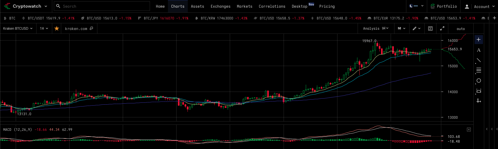

# Project 1 

## Project Summary

A relationship between Bitcoin (BTC) price and the S&P500 market indexes in a 5 year span.

## Details

A relationship between Bitcoin (BTC) price and the S&P500 market indexes in a 5 year span.

## Questions to ask are

If Bitcoin has been playing a safe-heaven role in the investment world, we should expect to see a negative relationship between stock and Bitcoin prices.

Below are three potential roles:

Is Bitcoin following a trend  different than financial markets. 

If stock prices are rallying, is this also visible in Bitcoin prices? 

A third potential outcome from our analysis may be that Bitcoin prices do not show a relationship with the stock market at all.

## Technical Requirements

The technical requirements for Project 1 are as follows.

 - Use Pandas to clean and format your dataset(s).

 - Create a Jupyter Notebook describing the data exploration and cleanup process.

 - Create a Jupyter Notebook illustrating the final data analysis.

 Use PyViz, Panel, Plotly Express, and Hvplot to create six to eight visualizations of your data (ideally, at least two per question you ask of your data), and then aggregate these visualizations into a dashboard.

 Save PNG images of your visualizations to distribute to the class and instructional team and for inclusion in your presentation and your repo's README.md file.

 Use one new Python library that hasn't been covered in class.

 Optionally, use at least one API, if you can find an API with data pertinent to your primary research questions.

Create a README.md in your repo with a write-up summarizing your major findings. This should include a heading for each question you asked of your data and under each heading a short description of what you found and any relevant plots.

 Reference:
 
 - [results ](results.md)

 - [presentation guidelines ](guidelines/PresentationGuidelines.md)
 - [presentation requirements](guidelines/PresentationRequirements.md)
 - [project guidelines ](guidelines/ProjectGuidelines.md)
 - [technical requirements](guidelines/TechnicalRequirements.md)

---

