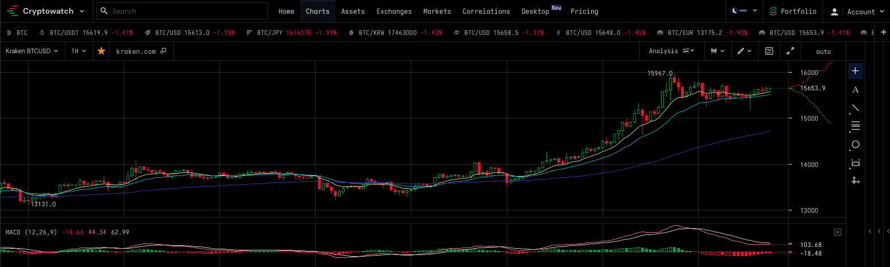

# Project 1 

## Project Results

A relationship between Bitcoin (BTC) price and the S&P500 market indexes in a 5 year span.

## Details

Data: 
Lets use data over a 5 year span
We rely on Federal Reserve Economic Data for the S&P500, and will pull from a reliable source
Using the Financial Modeling Prep API , this provides data for bitcoin prices that meets our needs for 10 years

Data Cleanup & Exploration:

We will want to ‘connect’ both types of data together, thru the date as the index
cleaning will require removing nulls from the S&P, as trading is only done on weekdays, while bitcoin ‘never sleeps’

- Displaying output along the data organization journey, will give us a visual if we are on the right path

- Our output was in a (json)dictionary panda dataframes 
- There was a need to organize both S&P500 and bitcoin pricing, into one dataframe 
- Correlations could then be seen

Data Analysis:

Use pandas dataframe.corr() we looked to find the correlation of our Pandas DataFrame columns: S&P500 closing price and Bitcon (closing/eod) price

## Results

How to interpret the correlation between BTC and S&P 500 prices?

The values from a correlation matrix range from -1 to 1. 

Closer to +1 means that both variables move closely together and in the same direction. 

A value of 0 meaning that there is no relationship between the variables. 

A negative correlation indicates that the variables move in different directions. 

The closer to -1 the stronger the inverse relationship.

## Visual Correlations

The red color of the graph means that the relationship is strong and positive. 

---

